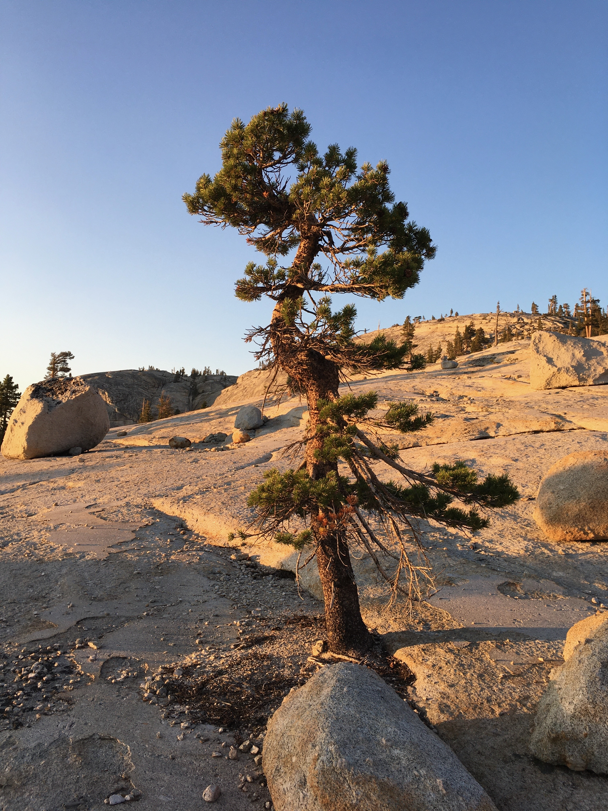
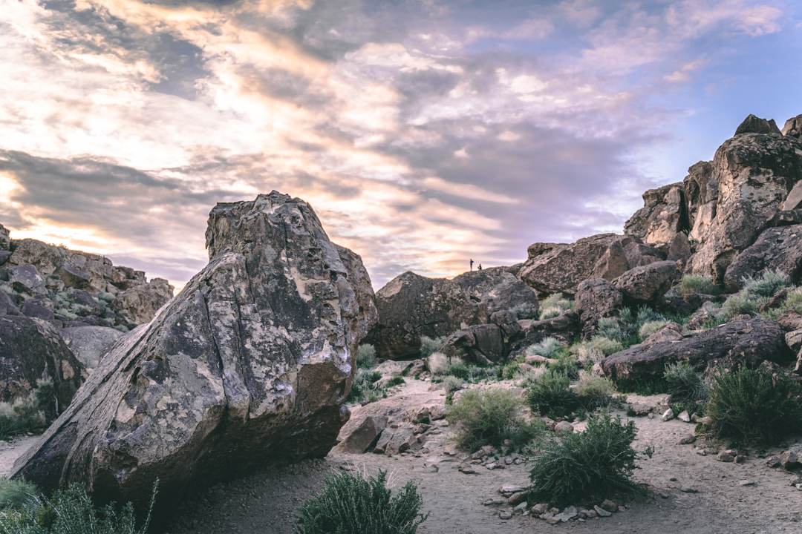

# David Anwyl


### About Me

Hi! I'm David, a 3rd year UCSD student studying Computer Science. I have an interest in both **Math** and  *Computer Science*, and am interested in fields that live in the intersection between the two. (That is to say you'd more likely find me in a theory and abstraction tagged course than an applications one)

Outside of school, my hobbies include rock climbing, playing music, and namely things that involve ***NOT*** being on my computer as much as possible. This is a lead in to one of my favorite quotes:

>If you ain't fishin', watcha doin'? - ~~Neil Armstrong~~ David Anwyl

I've also spent a lot of time backpacking in the Sierras, much of which had a big emphasis on Type II Fun. Some examples of my favorite places I've been backpacking (in no particular order):
- Tuolumne Meadows
- Dewey Point
- Joshua Tree 
- Desolation Wilderness


And some examples of Type II fun had (in order of most amount of suffering to least):
1. Getting Frostbite
2. Sleeping in 12˚ weather in a 25˚ rated sleeping bag
3. Being swarmed by africanized honey bees in Joshua Tree

Some trips/places I wish to get to in the future:
- [ ] Backcountry catch and cook
- [ ] Big Pine Lake Trail
- [ ] Trans-Catalina Trail


### Code Example
One of my favorite pieces of code I've written recently was for the CSE 100R Final, wherein we had to find the number of 0's in a compressed file header. I wrote a nifty little bash "one-liner" to get it done:

```bash
[user@sahara ~]$ for i in {1..999}; do printf '%s' {a..z}; done > output_file.txt && ./refcompress output_file.txt blah.txt && xxd -b blah.txt | head -999 |   grep -o "00000000" | wc -l
```
**Please note that I've changed the numbers in the code such that it would _not_ give you the correct answer.**

## Links
Here's a external link to my CSE15L lab reports: [CSE15L Lab Reports](https://danwyl.github.io/cse15l-lab-reports/)

Here's a relative link to the README file for this repo: [README.md](README.md)

Here's a section link that takes you to my about me: [About Me](#about-me)

## Photos
Here are some photos I've taken over the years in the outdoors (though I rarely take out a camera anymore)



Tuolumne Meadows /  2021


Yosemite / 2019


Bishop / 2019